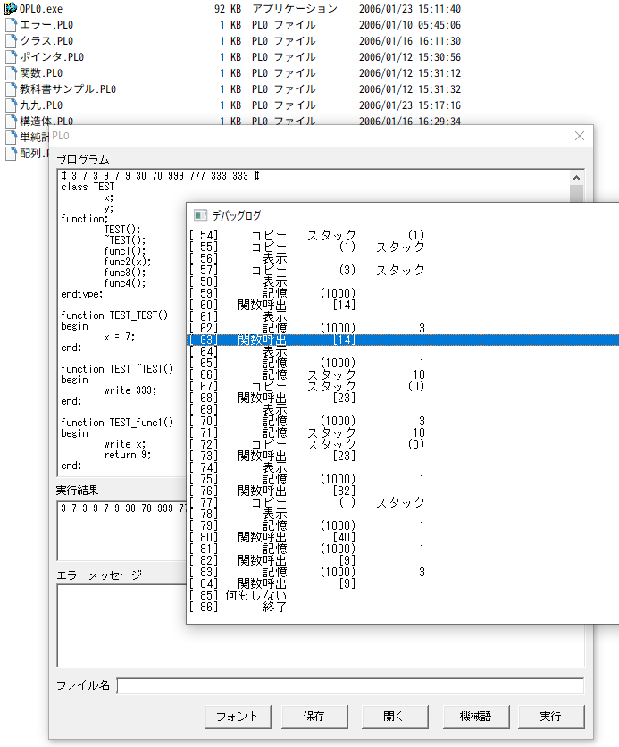

[Japanese](README.md) | [English](README.en.md)

# PL0PP（Advanced PL/0 Interpreter）
 
Minimal programming language "PL/0".Interpreter implementation.  
Developed for a class when I was a university student.  
unused yacc.  
  
No utility. Learning only.  
 
# Screen
 

# Features
 
* Basic PL/0 Features
* Array Implementation
* Mathematical formula Implementation
* structure Implementation
* Function Implementation
* C Similar Pointer Implementation
* Minimal Class Implementation
* Minimal footprint
* highly readable parser
* Adopted as an application for feature phone games
 
# Requirement

WindowsXP later  
Windows10 Support  
  
※Winodws API is GUI only.Portability to other OS.  
 
# Build

Microsoft Visual C++ 6.0  
Microsoft Visual Studio 2010 Support  
Visual Studio 2017 Express Support  
 
# Install
 
Clone in Git or download as a ZIP file  
run bin\OPL0.exe  
 
# 開発者
 
* MMGames
* mmmgames@gmail.com

Other Product  
[苦しんで覚えるＣ言語](https://9cguide.appspot.com/)  
[学習用Ｃ言語開発環境](https://forest.watch.impress.co.jp/library/software/gakucgengo/)  
 
# License

MIT license  
