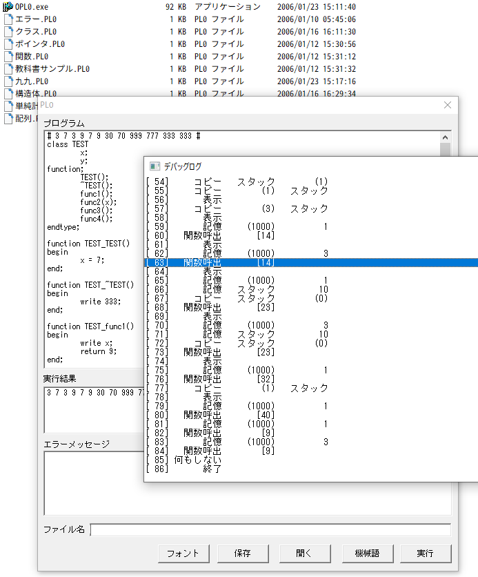

[日本語](README.md) | [English](README.en.md)

# PL0PP（拡張 PL/0 インタープリター）
 
「PL/0」と呼ばれるミニマムプログラミング言語のインタープリター実装です。  
大学生のときに授業で開発しました。  
yaccなどは使用せずに、言語パーサーと仮想マシンを全てプログラミングして実装しています。  
  
Luaがある現在では実用性は皆無ですが、学習用の教材としては一定の価値が見いだせるのではないかなと思います。  
 
# 画面
 

 
# 主要機能
 
* PL/0 の 基本機能を実装
* 配列に対応
* 数式計算に対応
* 構造体を実装
* 関数を実装
* Cに近いポインタ変数を実装
* 極めて簡易なクラスを実装
* 極小のフットプリント（約160行）の仮想マシン
* コードの読みやすさを重視して実装された言語パーサー
* ガラケーの商業ゲームアプリで内部スクリプト言語として採用実績あり 
 
# 動作環境

WindowsXP以降  
Windows10での動作を確認済み  
  
※Winodwsに依存したコードはGUI部分のみですので、  
　他のOS向けにビルドすることは難しくないと思われます。  
 
# ビルド環境

Microsoft Visual C++ 6.0  
Microsoft Visual Studio 2010 でのビルドと起動を確認  
Visual Studio 2017 Express でのビルドと起動を確認  
 
# インストール
 
 Gitでクローン、あるいは、ZIPとしてダウンロードし、  
「bin\OPL0.exe」を実行してください。  
 
# 使い方

画面上部の領域にプログラムを入力し、  
画面右下の「実行」ボタンをクリックして実行してください。  
「開く」ボタンで既存のコードを読み込みます。  
  
拡張した機能などを含む言語文法についての資料は紛失していますが、  
「bin」フォルダ内にあるサンプルプログラムでほぼ全機能の記述例を網羅しています。  

# 開発者
 
* MMGames
* mmmgames@gmail.com

他に以下のプロダクトがあります  
[苦しんで覚えるＣ言語](https://9cguide.appspot.com/)  
[学習用Ｃ言語開発環境](https://forest.watch.impress.co.jp/library/software/gakucgengo/)  
 
# License

MIT license  
